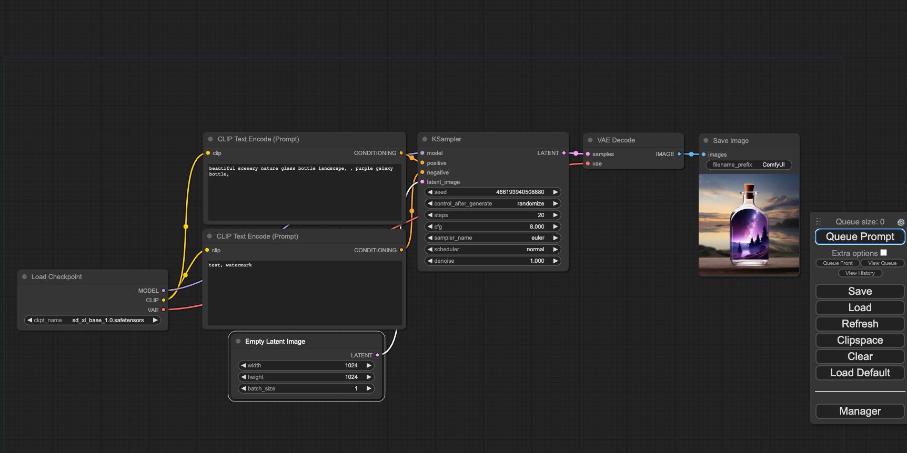
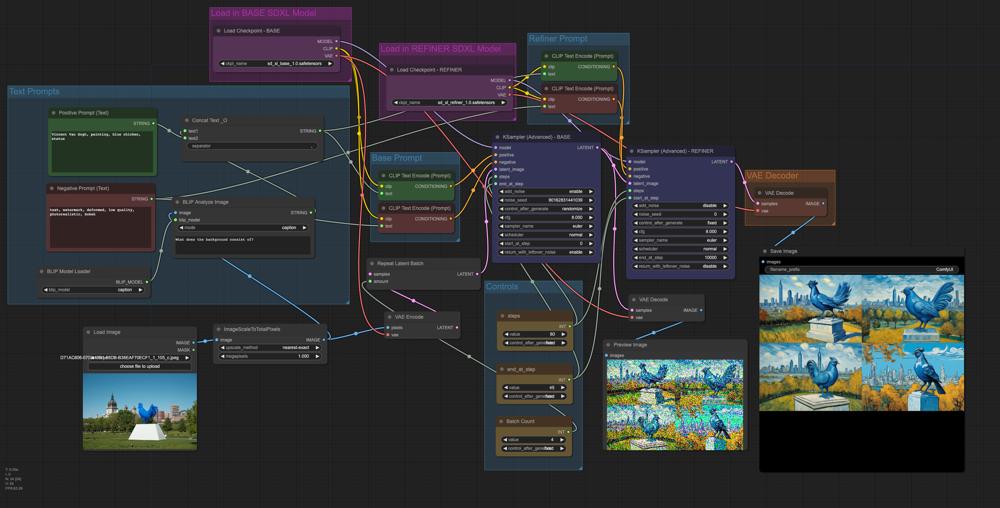
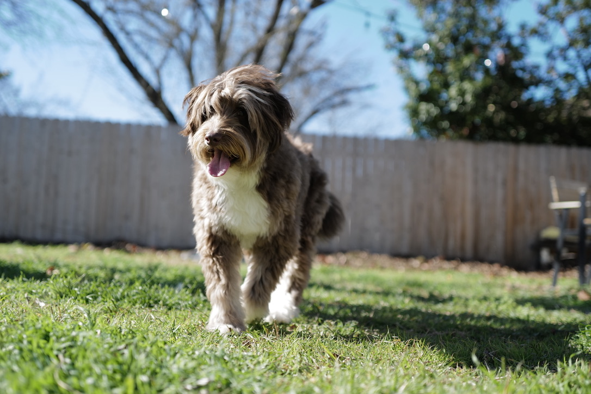
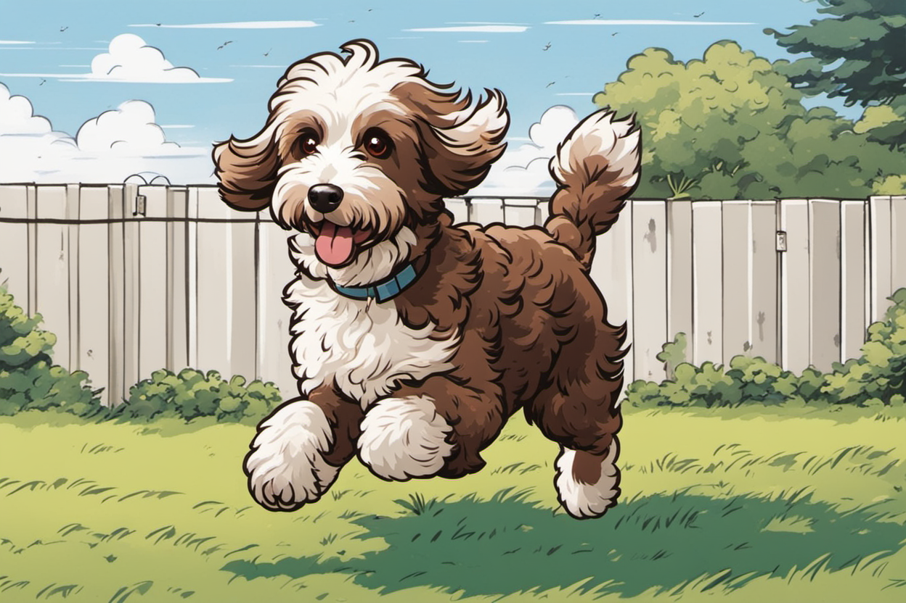
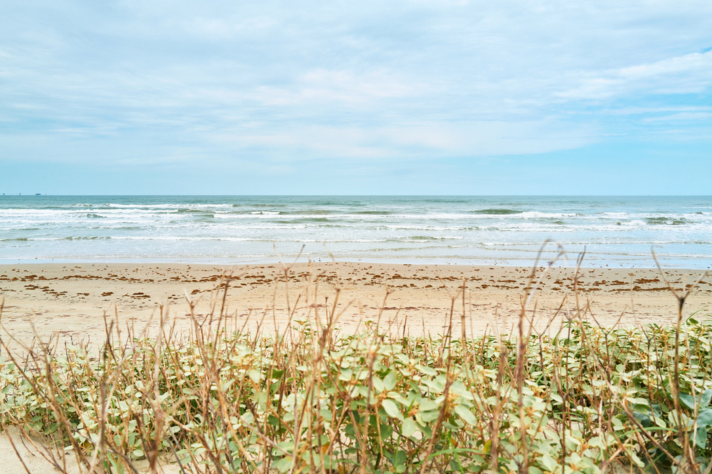
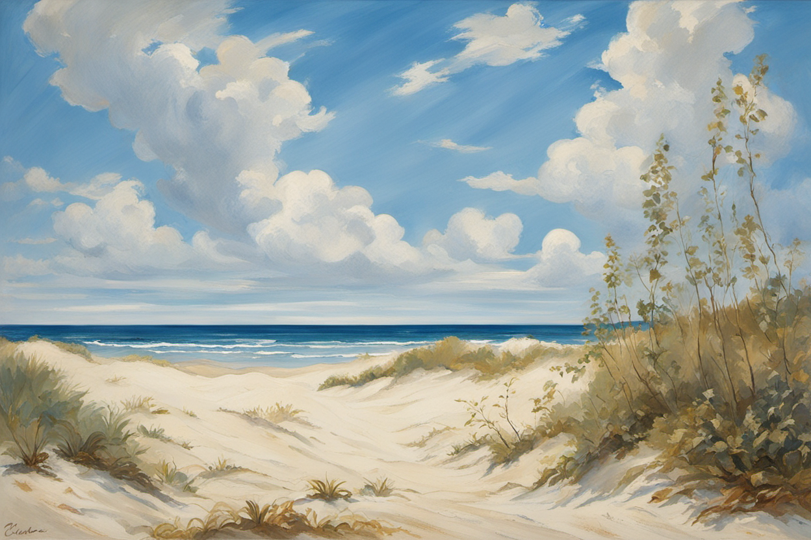

+++
title = "SDXL Img2Img Workflow"
author = ["Mikey O'Brien"]
date = "2023-08-27"
tags = ["blog", "project", "generative ai"]
categories = ["projects"]
draft = false
+++

Last week, I stumbled upon StabilityAI's new Stable Diffusion XL 1.0 models.
It's been a few months since I've explored image generation models, and I must
say, they've made incredible progress in a short span. One feature that
captivates me is the ability to take one image and generate a similar yet
distinct one from it. To delve into this further, I spent this weekend setting
up an automatic workflow. This nuanced approach slightly deviates from a pure
style transfer model. For instance, some of the original details—like unique
facial features—might get obscured in the generated image. In this post, I'll
guide you through the steps to establish a functional workflow.

Here's some quick background: the new SDXL models come in two parts—a base model
and a refiner model. The base model can operate independently, generating an
image on its own. The refiner adds the finishing touches to an almost complete
base image.

##### Base model generated image prepped for the refiner model

Getting started is straightforward, thanks to many available frontends. I began
with
[stable-diffusion-webui](https://github.com/AUTOMATIC1111/stable-diffusion-webui),
which I found the easiest to use. Simply clone the repo, run the batch script,
and navigate to the webpage that starts up. From there, enter your prompts and
generate images.

The downside to this frontend is that it's not very user-friendly for an img2img
base + refiner workflow. There's a lot of manual work: loading models,
generating images, and restarting if you're not happy with the output. Not to
mention the idle time waiting for models to load—which I particularly dislike.

Fortunately, another option is
[ComfyUI](https://github.com/comfyanonymous/ComfyUI). While more complex—thanks
to its graph/node/flowchart base—it's more efficient once you define a workflow.

##### ComfyUI

A key advantage of ComfyUI is that multiple models can be loaded simultaneously,
with different sampler configurations for each. This eliminates the idle time
spent switching between models. Almost all manual operations have also been
automated, allowing more time to fine-tune settings rather than doing mindless
tasks.

I built upon an example base + refiner workflow [found
here](https://comfyanonymous.github.io/ComfyUI_examples/sdxl/).  I modified the
original from text2img to img2img, using an uploaded image
as the starting point. For preprocessing, I employed `ImageScaleToTotalPixels`
since SDXL works best with 1MP images. I also utilized
[BLIP](https://github.com/salesforce/BLIP) to automatically caption the image,
ensuring that the generated artwork retains resemblance to the original.

##### Final Img2Img Workflow

That's it! I'm pleased with the workflow so far. However, I've noticed some issues
with how some positive/negative attributes are applied. The next step is
to better understand how to set attributes, integrate loopback and use prompt
delays to better preserve the original image. At times I would like to preserve
the original image as much as possible. 

To try this workflow yourself, download or drag any of the generated images
below into ComfyUI. Note that a few custom nodes are required: [WAS Node
Suite](https://github.com/WASasquatch/was-node-suite-comfyui) and [Quality of
life Suit:V2](https://github.com/omar92/ComfyUI-QualityOfLifeSuit_Omar92)

###### _positive_: anime artwork, 90s style, high-quality, brown aussiedoodle _negative_: text, watermark, deformed, low quality, photorealistic

###### _positive_: classicism painting _negative_: text, watermark, deformed, low quality, photorealistic  

