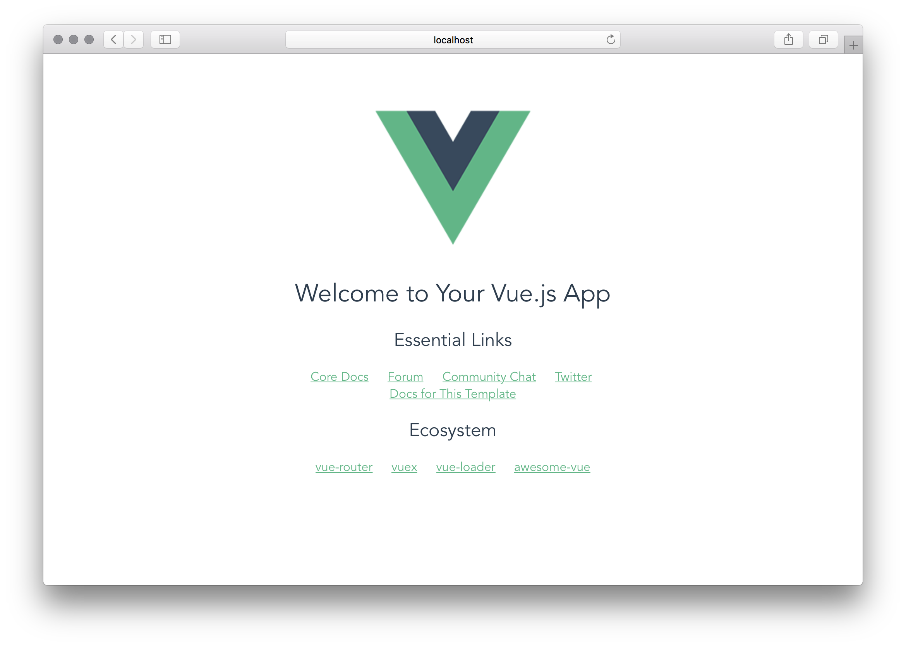
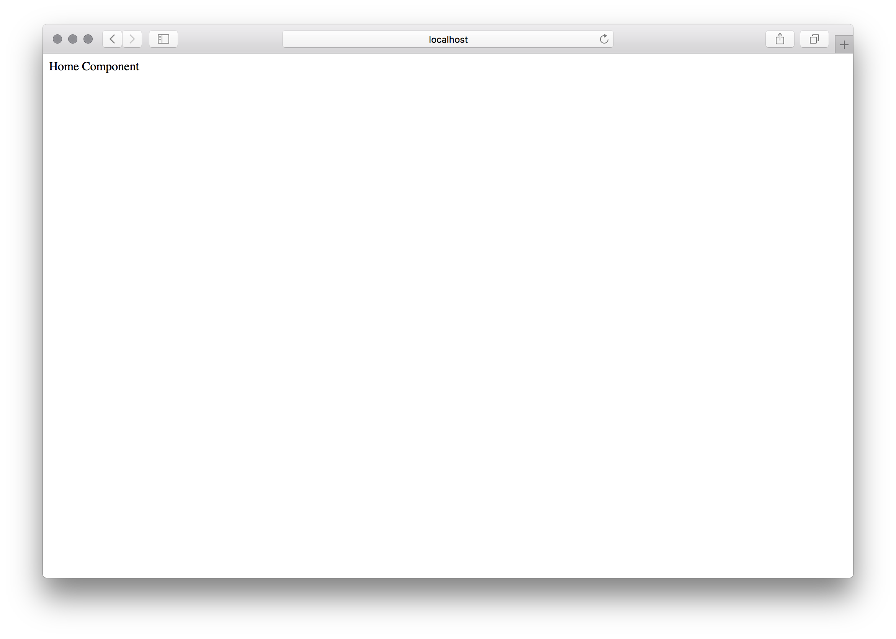

#+TITLE: Hugo
#+HUGO_BASE_DIR: ./
#+HUGO_SECTION: ./posts/

#+hugo_weight: auto
#+hugo_auto_set_lastmod: t
#+options: author:nil

* Homepage
:PROPERTIES:
:EXPORT_HUGO_SECTION:
:EXPORT_FILE_NAME: _index
:END:
This is the home of my blog!
* Blog Posts
:PROPERTIES:
:EXPORT_DATE: 2019-12-16
:EXPORT_FILE_NAME: _index
:END:
** Using ox-hugo to manage content
:PROPERTIES:
:EXPORT_FILE_NAME: using-ox-hugo-to-manage-content
:EXPORT_DATE: 2020-04-19
:END:
As I've made my way deeper into the emacs rabbit hole I stumbled upon a package
called [[https://ox-hugo.scripter.co][ox-hugo]] that allows you to use .org files to manage content that can then
be deployed with the static site generator, [[https://gohugo.io/][hugo]]. I've toyed with the idea of
moving it over the past few months, only now getting the configuration in place
to make it a reality as im now managing all content ox-hugo. In the brief time
I've used it I'm confident in recommending it if you already are familiar with
org-mode and emacs.

Fortunately the package is included as an option with [[https://github.com/hlissner/doom-emacs][doom-emacs]] and is simple as adding,
#+BEGIN_SRC lisp
(org
 +hugo)
#+END_SRC
to your init.el file and running the corresponding call to install the ox-hugo package.
#+BEGIN_SRC sh
.emacs.d/bin/doom sync
#+END_SRC

Here is an example .org file that can be immediately used with a simple theme I
put together to get a better understanding of hugo ([[https://github.com/mikeyobrien/hugo-theme-addison]])
#+BEGIN_SRC org
,#+TITLE: Hugo
,#+HUGO_BASE_DIR: ./
,#+HUGO_SECTION: ./posts/

,#+hugo_weight: auto
,#+hugo_auto_set_lastmod: t
,#+options: author:nil

,* Homepage
:PROPERTIES:
:EXPORT_HUGO_SECTION:
:EXPORT_FILE_NAME: _index
:END:
This is the home of my blog!
,* Blog Posts
:PROPERTIES:
:EXPORT_DATE: 2019-12-16
:EXPORT_FILE_NAME: _index
:END:
,** Today Was A Good Day
:PROPERTIES:
:EXPORT_DATE: 2018-06-12
:EXPORT_FILE_NAME: today_was_a_good_day
:END:
  Lorem ipsum dolor sit amet, consectetur adipiscing elit. Sed eget facilisis mi,
  ut efficitur libero. In hac habitasse platea dictumst. Pellentesque habitant
  morbi tristique senectus et netus et malesuada fames ac turpis egestas. Donec at
  iaculis sem, convallis elementum ipsum. Donec aliquam ex quis orci ullamcorper
  ultricies. In at efficitur libero. Fusce vitae lorem ac neque bibendum vehicula.
  Proin viverra gravida libero sit amet dapibus. Nulla tempor neque quis nibh
  euismod commodo nec non augue. Suspendisse sed accumsan risus. Curabitur
  imperdiet ex quis eros scelerisque, non blandit augue condimentum.
,** TODO Tomorrow's Thoughts
  Nullam eu ante vel est convallis dignissim. Fusce suscipit, wisi nec facilisis
  facilisis, est dui fermentum leo, quis tempor ligula erat quis odio. Nunc
  porta vulputate tellus. Nunc rutrum turpis sed pede. Sed bibendum. Aliquam
  posuere. Nunc aliquet, augue nec adipiscing interdum, lacus tellus malesuada
  massa, quis varius mi purus non odio. Pellentesque condimentum, magna ut
  suscipit hendrerit, ipsum augue ornare nulla, non luctus diam neque sit amet
  urna. Curabitur vulputate vestibulum lorem. Fusce sagittis, libero non
  molestie mollis, magna orci ultrices dolor, at vulputate neque nulla lacinia
  eros. Sed id ligula quis est convallis tempor. Curabitur lacinia pulvinar
  nibh. Nam a sapien.
,* About
:PROPERTIES:
:EXPORT_FILE_NAME: _index
:EXPORT_HUGO_SECTION: about
:END:
Tell the internet about yourself here.
#+END_SRC

Place this .org file at the root of your hugo website directory.
Source for this blog can be found at [[https://github.com/mikeyobrien/blog]].

** TODO Development Tools 2020
:PROPERTIES:
:EXPORT_FILE_NAME: 2020_development_tools
:END:
I enjoy trying out new tools and environments so what I use for coding changes
constantly. I'd like to take sometime to catalog what I'm using currently as I'm
certain it will likely change over the coming months. I'll summarize the main
tools I use now and follow up with a detail overview of why these tools are
currently in my toolbox.
- Text editor: Emacs
- Task management: Org-mode
- OS: MacOS + Linux
- Chat: Teams
*** Emacs
Why emacs? Extensibility. Over the past couple years i've went from VS Code to
VIM + TMux to Pycharm while dabbling here and there with emacs boilerplate
configs (doom/spacemacs). While I couldn't find myself being productive enough
to use it for my day job until recently I had always seen the potential. I was
an org-mode convert about a year ago and in that time I slowly became more
familiar with using emacs.
*** Org-Mode
The gateway drug into the emacs ecosystem. I've tried quitting in the past for
other GTD management systems but I always come back. It's not the prettiest
system but it just works. It's integration and extensibility are unmatched. My
conversion to using emacs for more than just task management was due to the
scope of this package alone.
*** OS
MacOS during my day job and Linux at home. Particularly Arch. Like emacs I keep
coming back. I have a personal macbook pro that I've recently purchased but as I
continue to dive deeper into linux and the widespread support it not receives.
It's hard to use anything else. I have also become more and more frustrated with
the apple ecosystem. It's a fantastic OS for the average consumer but the
restrictions being put in place to protect people are becoming more and more
suffocating. I will still take MacOS as theres less tinkering to get a working
enviroment done but comparatively to any linux distro it's a pain in the ass to
customize and extend.
** SD to Austin - 18 months later
:PROPERTIES:
:EXPORT_DATE: 2020-04-12
:EXPORT_FILE_NAME: austin-18-months-later
:END:
It's been a little over 18 months since we moved to Austin and this post about 6
months overdue. I apologize as It's been quite busy since starting a new job
shortly before the one year anniversary, but with the world on lockdown, I find
myself with a little more time to devote to hobbies, back-logged projects, and
self-improvement. Without rambling too much longer, I'd like to go over my
thoughts on living in Austin over the past 18 months.

*** The People
As I noted in the original post on moving to Austin from SD. People being very
friendly has held true. I've continually noticed that people will go out of
their way to help you. Something I didn't see quite as much in CA. Not to say
people in CA are not friendly. I just felt it was less likely to have a random
stranger offer help.

I do feel for the Austinites that have lived here for decades as the city is a
shell of what it was before. The sheer growth of people from all over the
country has changed the cities characted. For better of for worse is up for
debate. Also, more and more people are being affected from the increased CoL and
its apparent with the growing homeless population. It is more troublesome than
what I have experienced in San Diego and hope solutions are put in place to help
those affected.

*** The Cost of Living
Yes, I raved about the cost of living before and it is still a lot cheaper but
not as much as I would have expected. There are still expensive areas and
restaurants in Austin and it's only getting more expensive. Housing prices are
not much less than SD in desirable areas near the city center but significantly
more so in the suburbs. I've benefited from not paying property taxes thus far and
am not looking forward to doing so in the coming months when I move forward with
purchasing property here. Most of the savings come in everyday expenses such as gas
and groceries. There is also the added benefit of renting and not having state
income tax. The extra cash pocketed has funded increased travel and savings
which I'd take in a heartbeat over the so-called beach/weather tax in CA.

*** Job Market
Being a software engineer, I don't think theres a better place to be. Sure there
are other hot spots in SF, NY, Seattle, etc. but they are all very expensive CoL
wise and I suspect don't have the growing city vibe that I have grown to love in
Austin. I have first hand experienced the job market when I lost my job last
year and was able to land a gig with a company that I am very happy to be a part
of. I don't think I would have been exposed to as great opportunities had I
stayed in San Diego. On top of it all I love that kolaches and breakfast tacos
are regularly brought in for lunch.

*** Food
Outstanding. I haven't found a shortage of any cuisine I am interested in. Sure
there is better quality and diversity in food capitals such as NY, LA, or SF but
there hasn't been an issue as nearly everything is here that would satisfy my
cravings. With frequent trips out to SoCal to visit family there is nothing
missed. Not to mention foods in Texas that can't be found elsewhere -- BBQ, TX
style Tacos, kolaches, and a wide range of fusion foods.

*** Traffic
It's not nearly as bad as other major cities from what I've experienced, but
very bad for the city size. The infrastructure is just not their to support the
booming population. I do not look forward to the day I have to commute.

*** TLDR
Austin is a great city. It is struggling growing pains like increased
traffic, homelessness, and an increasing CoL but the good has outweighed the bad
and I look forward to planting some roots here and purchasing a home in the near
future.

** Setting up PostgreSQL on MacOS
:PROPERTIES:
:EXPORT_FILE_NAME: setting_up_postgresql_on_macos
:EXPORT_DATE: 2019-02-18
:END:
For this tutorial we will be using postgres.app from the folks at https://eggerapps.at/ to install and setup a local development server on macOS.

Download and install using the instructions at https://postgresapp.com/

Start postgres from the applications folder
Ensure the CLI tools are working by typing,
#+BEGIN_SRC sh
createdb
#+END_SRC

This should result in the following error if everything was installed correctly,
#+BEGIN_SRC sh
createdb: database creation failed: ERROR: database "username" already exists
#+END_SRC

To create your development db enter into the console,
#+BEGIN_SRC sh
createdb devdb
#+END_SRC

If for whatever reason this db needs to be removed use,
#+BEGIN_SRC sh
dropdb devdb
#+END_SRC

Access the db we have just created,
#+BEGIN_SRC sh
psql devdb
#+END_SRC

This should drop you into an interactive terminal program where we will be able to enter, edit, and execute sql commands.

From here you can also execute internal psql commands beginning with the backslash character, "",
that are not SQL commands.

You can see what commands are available to you with the help command,

#+BEGIN_SRC sh
devdb=# help
You are using psql, the command-line interface to PostgreSQL.
Type:  \copyright for distribution terms
       \h for help with SQL commands
       \? for help with psql commands
       \g or terminate with semicolon to execute query
       \q to quit
#+END_SRC

*** Moving from San Diego to Austin
:PROPERTIES:
:EXPORT_FILE_NAME: moving_from_san_diego_to_austin
:EXPORT_DATE: 2018-10-09
:END:
A couple of months ago an opportunity opened up at work to move to Austin,
Texas. I toyed with the idea of making the move but never took it seriously.
Next thing you know, the lease on my apartment at the time was about to end and
I still had not found a new place to live in San Diego. Queue time to take the
decision seriously. Growing up and attending college in San Diego I felt like it
would be a good time to experience something new and committed to going. And,
after a hectic two months of moving halfway across the country, I'm finally
starting to settle in. Here are some things I've learned leading up to the move
and what I've learned from a little over a month in Austin.
*** Start as early as possible
Moving across the country with one month notice is certainly possible but I'd
highly recommend against it. My girlfriend and I had a little less than a month
to find a place to live, pack, ship, and drive out to Texas to avoid being
homeless. We were fortunate my family in San Antonio was able to view apartments
for us. If not we would have been rushed into picking a place to live. Spreading
out the cadence at which you pack, donate, and sell items relieves a lot of the
pressure of the move. Make the months prior as easy possible by starting as soon
as you can.
*** Save money by shipping
Initially, we thought of using a moving company to pack up our belongings and
move them to Austin for us. While this would be the most painless route, expect
to burn a huge hole in your pocket. Our next option was to throw our belongings
in a U-Haul and drive them ourselves. That too was costlier then we had
expected. Especially taking into account the actual value of everything.

We settled on packing whatever valuables we could fit into the back of my car
and use Amtrak's shipping services for the rest (clothes, books, kitchen goods,
etc). What didn't fit we shipped using UPS which could have been saved even
further by shopping shipping services. For furniture, we realized we could
donate or sell most of it and rebuy the same furniture and still save. Overall
we offset the costs by more than half and were able to redistribute the costs of
buying new furniture to after the move. This option may not work for everyone
but is worth taking into account if you're willing to part with most of your
belongings and start over.
*** Austin feels small
This one is subjective. Coming from San Diego and spending a significant time in
LA. Austin feels small. The small neighboring city of Round Rock is 21 minutes
north of Downtown Austin. My hometown of Mira Mesa in San Diego is 25 minutes
from Downtown San Diego yet we're still considered to be in the city of San
Diego. Everything feel's closer then I am accustomed to. This doesn't mean your
commute will be short though. Austin is supposedly notorious for its traffic.
Although nothing out of the ordinary compared to LA or San Francisco.
*** Texans are nice
It will take a while to get used to how nice people have been in Texas. It's
downright strange at times. Friendly... but strange. Just the other day we were
in the parking lot with our throw pillow haul from HomeGoods when a random
stranger was genuinely excited for us when he saw that we had bought pillows.
The week prior we were at Whole Foods when the cashier complimented on our
choice of breakfast tacos and asked about our plans for the day. I promised I'm
not trying to be rude when I stare at you with a confused smile I just don't
know how to react yet.
*** It seems as techie as they say
I don't have a large sample size to build on but five of the six people on our
TopGolf league team works for tech companies. It isn't shocking to see large
tech company offices as you drive through Austin. This is a stark contrast to
what I'd experienced in Southern California.
*** Californians are everywhere
This may not come as a surprise to those who have lived in Austin for years but
it certainly surprised me how noticeable it was. In our apartment complex alone
I've spotted 5 California plates. Out and about it's not unusual to see people
representing their hometown teams. A recent post on culturemap estimated from
2010 to 2014 the Austin area gained on average 8 Californians per day. This was
prior to Austin being named "Best City to Live" two years in a row by U.S. News
and World Report. It's hard to imagine the influx to stop as long as
California's cost of living continues to rise. We are sorry.
*** The food has been outstanding
I was concerned about moving away from the land of California burritos in San
Diego and the sprawling food metropolitan of LA but Austin was quick to quell
those concerns. The BBQ is amazing and I have yet to go to the BBQ capital of
Texas 35 minutes south in Lockhart. Breakfast Tacos may not be as good as San
Diego burritos but they will definitely keep me satisfied until I go back. The
pho I've tried easily competes with the best I've had in Little Saigon. The
xiaolongbao (soup dumplings) are better than any I've had in San Diego prior to
Din Tai Fung opening. We have most of the top burger places, Hop Doddy, Shake
Shack, Whataburger, In-n-out, and Austin's very own P Terry's (which was a
pleasant surprise). And from my understanding, this is only the tip of the
iceberg. I'm looking forward to eating my way through Austin as the months roll
by.
*** Your money goes a long way relative to California
As most know, one of the driving forces for the influx of new Austin residents
is the cost of living. It was one of the driving forces for me. I've noticed
this most in the cost of gas and housing. Prior to leaving San Diego, it would
cost anywhere from $3.70-$4.00 per gallon to fill up my tank. In Austin, it's
been anywhere from $2.40-$2.80 per gallon. My Austin apartment costs roughly the
same as the one I had in Oceanside except for its 3 years old versus 30 years
old. The gym has more than 3 treadmills and the washing machine and dryer are
in-unit. Getting the same quality apartment in San Diego would have cost upwards
of 50% more depending on the location. On top of the general day-to-day
expenses, Texas has no state income tax. There's a downside to all this though,
I've been made aware of the cost of living going up and going up fast. Housing
prices in some neighborhoods reflect those in California, some residents are
being forced out of neighborhoods they've lived in for generations. It's
unfortunate. Hopefully, it doesn't snowball into the issues we are seeing in the
bay area.
*** Conclusion
It has only been a month but so far Austin has exceeded all expectations and I
look forward to experiencing what more this city has to offer. It will be
interesting to see how my opinion of Austin changes over the course of a year
and will follow up on this post then. If you've moved to Austin from another
state, I'd love to hear your thoughts.

** Setting up OpenVPN on GCP
:PROPERTIES:
:EXPORT_DATE: 2018-10-08
:EXPORT_FILE_NAME: setting_up_openvpn_on_gcp
:END:
At work I've recently been assigned with analyzing Ransomware samples to improve
our detection heuristics. As an extra precaution I've set up OpenVPN on a GCP
instance to ensure my home IP is not being captured by bad actors.

If you don't use GCP and would like to use this as a guide for another cloud
provider feel free, as the same general steps apply.

*** Compute Instance Configuration
First, create a compute instance from the cloud console. Allow HTTP and HTTPS
traffic. If you want to force HTTPS, only select the allow HTTPS traffic option.

Once the instance is up and running, go to VPC network -> External IP Addresses
from the selection drawer in the top left. Change the external ip address for
the new VM instance from Ephemeral to Static.

Lastly, we need to setup the firewall rules for openvpn traffic. Select firewall
rules from the side tab, then click select 'Create Firewall Rule'. Name the
first rule openvpn-ingress. Change the following,

#+BEGIN_SRC
Target tags: openvpn Source filter: 0.0.0.0/0 (if you will be accessing openvpn
from a static address, for example 1.2.3.4, you can change the filter to
(1.2.3.4/32) for added security.) Protocols and ports: udp 1194 (you can
customize this during openvpn setup or use the default) #+END_SRC

Change the same settings for an openvpn-egress rule, but change the direction of
traffic to egress.

That should be all the setup from the GCP Console.

*** Configuring the compute instance.
SSH into the compute instance. If you have the Google Cloud SDK installed and
configured for your account run,

#+BEGIN_SRC sh
gcloud compute ssh vpn #+END_SRC

From the compute instance we'll use the setup script from
https://github.com/angristan/openvpn-install to expedite the openvpn install
process.

Get the script and make it executable:

#+BEGIN_SRC sh
curl -O
https://raw.githubusercontent.com/Angristan/openvpn-install/master/openvpn-install.sh
chmod +x openvpn-install.sh #+END_SRC

Run the script,
#+BEGIN_SRC
./openvpn-install.sh #+END_SRC

Change the IP address to the static address assigned to the instance. Hit enter
for default selections for IPv6 support, listening port, protocol, dns resolver,
compression, and encryption

#+BEGIN_SRC sh

Your host does not appear to have IPv6 connectivity.

Do you want to enable IPv6 support (NAT)? [y/n]: n

What port do you want OpenVPN to listen to?
   1) Default: 1194
   2) Custom
   3) Random [49152-65535]
Port choice [1-3]: 1

What protocol do you want OpenVPN to use? UDP is faster. Unless it is not
available, you shouldn't use TCP.
   1) UDP
   2) TCP
Protocol [1-2]: 1

What DNS resolvers do you want to use with the VPN?
   1) Current system resolvers (from /etc/resolv.conf)
   2) Self-hosted DNS Resolver (Unbound)
   3) Cloudflare (Anycast: worldwide)
   4) Quad9 (Anycast: worldwide)
   5) Quad9 uncensored (Anycast: worldwide)
   6) FDN (France)
   7) DNS.WATCH (Germany)
   8) OpenDNS (Anycast: worldwide)
   9) Google (Anycast: worldwide)
   10) Yandex Basic (Russia)
   11) AdGuard DNS (Russia)
DNS [1-10]: 3

Do you want to use compression? It is not recommended since the VORACLE attack
make use of it. Enable compression? [y/n]: n

Do you want to customize encryption settings? Unless you know what you're doing,
you should stick with the default parameters provided by the script. Note that
whatever you choose, all the choices presented in the script are safe. (Unlike
OpenVPN's defaults) See
https://github.com/angristan/openvpn-install#security-and-encryption to learn
more.

Customize encryption settings? [y/n]: n

Okay, that was all I needed. We are ready to setup your OpenVPN server now. You
will be able to generate a client at the end of the installation. Press any key
to continue...
#+END_SRC

Continue with the installation.

After the installation succeeds you'll be prompted with the client name and
password/passwordless security settings for the machine you intend to connect to
the server.

Lastly, the instance needs to be configured to forward ipv4 packets.

Edit /etc/sysctl.conf and uncommment,
#+BEGIN_SRC conf
-#net.ipv4.ip_forward=1
+net.ipv4.ip_forward=1
#+END_SRC

The OpenVPN server should now be up and running.
*** Client Setup
From your client machine run,

#+BEGIN_SRC
gcloud compute scp <username>@<instance>:~/<clientname>.ovpn .
#+END_SRC

Import that config into your openvpn client and connect. If everything
configured correctly you should see the ip of your compute instance when
searching "whats my ip" on google.

** A New Start
:PROPERTIES:
:EXPORT_DATE: 2018-05-31
:EXPORT_FILE_NAME: a_new_start
:END:
I've been meaning to start a blog for awhile now. In reality, I have a couple
times now. Both times life got in the way from fully dedicating the time to
write quality posts. Not this time. Seriously. I believe documentating one's
experiences and challenges in life is a rewarding activity (for both parties). I
don't remember how many time's over the past year and a half of my professional
career I've looked for the same exact blog to do the same exact thing that I've
forgotten for the 10th time. Hopefully I could be that resource for another
individual on their 10th attempt to complete a task. If not hopefully I can be
at least a source of entertainment.

Anyway, this blog will be focused on my life as a software engineer, with some
personal asides thrown in. You can expect mostly opinions on technical subjects,
documentation on how I completed/implemented X, how X tool helped me be more
productive, how X tool sucks, etc. Just don't be surprised when random posts are
thrown in about books I've read, trips I've taken, or other personal life
stories get grouped in. Looking forward to having anyone along for the journey -
if not, future me, here's to recording what I've learned and what I've
experienced. I know reflecting on it will be more than worth it.
** Creating a MEVN stack boilerplate
:PROPERTIES:
:EXPORT_DATE: 2018-06-12
:EXPORT_FILE_NAME: creating_a_mevn_stack_boilerplate
:END:
This post will cover the basic steps needed to set up a project using the MEVN
stack (mongo, express, vue, and nginx). Prior warning, if you are looking for a
tutorial on creating a web application using the MEVN stack you may want to look
elsewhere. I'll only be covering the basic project structure, packages, and
tools necessary to get started.

*** Prerequisites
- Basic understanding of javascript
- Commandline familiarity
- Familiarity with NPM

To be begin we first need to insure that node is installed on the machine. We
will be using the vue-cli tool to generate the project. To check that it is
installed try running,

#+BEGIN_SRC sh
$ node --version
#+END_SRC

If a version number isn't installed we can install nodejs with the following,

#+BEGIN_SRC sh
$ curl -sL https://deb.nodesource.com/setup_8.x | sudo -E bash -
$ sudo apt-get install -y nodejs
#+END_SRC

Now that nodejs and npm are installed we can begin the process of setting up our vue and express project folder.

First install vue-cli:
#+BEGIN_SRC sh
$ npm install -g vue-cli
#+END_SRC

Now that vue-cli is installed we can use webpack template to generate a vue project
#+BEGIN_SRC sh
$ vue init webpack project
#+END_SRC

For this particular project, choose the default settings for everything. Once
finished initializing, move to the newly generated project folder
#+BEGIN_SRC sh
$ cd project
#+END_SRC

Now that we're in our root project folder we'll create a server subdirectory
that will contain the backend express code,

#+BEGIN_SRC sh
$ mkdir server
#+END_SRC

Once we're all set up the directory structure will look like this,

#+BEGIN_SRC
project/
├── build
├── config
├── node_modules
├── server
├── src
├── static
├── test
├── README.md
├── index.html
├── package-lock.json
└── package.json
#+END_SRC
*** Backend Configuration
We're now ready to setup our express backend and link it to mongodb using the
mongoose library.

#+BEGIN_SRC sh
$ cd server
$ npm init
#+END_SRC

Let's being with installing the basic packages that are required for our
application
#+BEGIN_SRC sh
$ npm install --save express cors morgan body-parser mongoose
#+END_SRC
- express is used for handling http requests and responses.
- cors allows cross-origin resource sharing.
- morgan is an express middleware for logging.
- body-parser will parse incoming request bodies before hitting handlers.
- mongoose will be used to connect to our mongo db.

In the server directory, make a new directory src to hold all our backend source code, and create the app.js file,

#+BEGIN_SRC sh
$ mkdir src && touch src/app.js
#+END_SRC

Also, create our models directory to hold our future schemas,

#+BEGIN_SRC sh
$ mkdir models
#+END_SRC

Edit the new app.js file to contain all our installed packages,
#+BEGIN_SRC javascript
const express = require('express')
const bodyParser = require('body-parser')
const cors = require('cors')
const morgan = require('morgan')
var mongoose = require('mongoose');

// Express configuration
const app = express()
app.use(morgan('combined'))
app.use(bodyParser.json())
app.use(cors())
app.listen(process.env.PORT || 8081)

// Mongoose configuration
mongoose.connect('mongodb://localhost:27017/project');
var db = mongoose.connection;
db.on("error", console.error.bind(console, "connection error"));
db.once("open", function(callback){
  console.log("Connection Succeeded");
});

// Test handler
app.get('/test', (req, res) => {
  res.send(
    [{
      serviceName: 'test',
      isRunning: true
    }]
  )
})
#+END_SRC

Let's run the application,
#+BEGIN_SRC sh
$ node app.js
#+END_SRC

You'll most likely see the connection error printed to the console. If so,
follow the steps to install the community edition for your OS at,
https://docs.mongodb.com/manual/administration/install-community/

Now that mongodb is installed let's try that again.

Hopefully we now see "Connection Succeeded".

Running the server app using node app.js isn't very convenient, lets install
nodemon so everytime our server code is updated we reload the backend code,

#+BEGIN_SRC sh
$ npm install --save nodemon
#+END_SRC

Edit package.json to contain the following script,
#+BEGIN_SRC json
{
  "name": "server",
  "version": "1.0.0",
  "description": "",
  "main": "index.js",
  "scripts": {
    "start": "./node_modules/nodemon/bin/nodemon.js src/app.js",
    "test": "echo \"Error: no test specified\" && exit 1"
  },
  "author": "",
  "license": "ISC"
}
#+END_SRC

Lets confirm everything is working as expected. Run the command,

#+BEGIN_SRC sh
$ npm run start
#+END_SRC

And direct your browser to http://localhost:8081. Update the test function in src/app.js to

#+BEGIN_SRC javascript
// Test handler
app.get('/test', (req, res) => {
  res.send(
    [{
      serviceName: 'test',
      isRunning: false
    }]
  )
})
#+END_SRC

Save the file and refresh your browser. You should now see the updated test handler. Our backend is now set up for basic testing.

*** Frontend Configuration

Let's ensure everything is working correctly. Switch back to root of the project,

#+BEGIN_SRC sh
$ cd ..
#+END_SRC

Install the base packages we'll need for this project.

#+BEGIN_SRC sh
$ npm install axios
#+END_SRC

Well use the axios library to make http requests to our backend service.
run,

#+BEGIN_SRC sh
npm run dev
#+END_SRC

Open your browser to: http://localhost:8081 where you should see something similar to the image below.

Great! Everything seems to be working. Let's begin by cleaning up some of the boilerplate provided by vue init and creating our src directory from scratch.

#+BEGIN_SRC sh
$ sudo rm -rf src\*
#+END_SRC

**** main.js

Create the entry-point to our vue application under src.

#+BEGIN_SRC sh
touch src\main.js
#+END_SRC

Edit the file to contain,

#+BEGIN_SRC jsx
// The Vue build version to load with the `import` command
// (runtime-only or standalone) has been set in webpack.base.conf with an alias.
import Vue from 'vue'
import App from './App'
import router from './router'

Vue.config.productionTip = false

/* eslint-disable no-new */
new Vue({
  el: '#app',
  router,
  components: { App },
  template: '<App/>'
})
#+END_SRC

**** Root Vue
Create the root vue file,

#+BEGIN_SRC sh
$ touch src/App.Vue
#+END_SRC

Edit the file to contain,

#+BEGIN_SRC jsx
<template>
  

    <router-view/>
  

</template>

#+END_SRC

**** Vue Router

Create the router directory,
#+BEGIN_SRC sh
$ mkdir src/router
#+END_SRC

Create the index.js file that declares our apps routes,

#+BEGIN_SRC
$ touch src/router/index.js
#+END_SRC

Edit the file to contain,

#+BEGIN_SRC jsx
import Vue from 'vue'
import Router from 'vue-router'
import HelloWorld from '@/components/Home'

Vue.use(Router)

export default new Router({
  mode: 'history',
  routes: [
    {
      path: '/',
      name: 'Home',
      component: Home
    }
  ]
})
#+END_SRC

**** Services directory
Create the services directory to contain the code that connects to our backend api,

#+BEGIN_SRC sh
$ mkdir src/services
#+END_SRC

Create a file called Api.js and add the following to the file,

#+BEGIN_SRC jsx
import axios from 'axios'

export default() => {
  return axios.create({
    baseURL: `http://localhost:8081`
  })
}
#+END_SRC
In the same file let's add another file TestService.js that will make requests to our backend.

Add to the file,
#+BEGIN_SRC jsx
import Api from '@/services/Api'

export default {
  testStatus () {
    return Api().get('test')
  }
}
#+END_SRC
**** Home Component
Create the components directory,

#+BEGIN_SRC sh
$ mkdir src/components
#+END_SRC

Create the Home component
#+BEGIN_SRC sh
touch src/components/Home.vue
#+END_SRC

Add to the Home.vue file,

#+BEGIN_SRC jsx
<template>
  

    {{ status }}
  

</template>

<script>
import TestService from '@/services/TestService'

export default {
  name: 'Home',
  data () {
    return {
      status: []
#+END_SRC

**** Assets
Finally create a directory to hold any future assets.

#+BEGIN_SRC sh
$ mkdir src/assets
#+END_SRC

If you stopped the dev server run npm run dev
Check to see if everything was created properly at http://localhost:8081

If it looks similar to the picture above our frontend and backend our now connected!
*** Deploying the application
Now that the frontend and backend are running successfully on the local machine,
it's time to provision the server that we will deploy the boilerplate
application on.

The rest of the post assumes you have a remote server to deploy the application
to using any hosting provider of your choice (aws, google cloud, azure,
digitalocean, etc.)
**** MongoDB

SSH into the remote server and follow the previous instructions used to
provision our local machine.
**** nginx
Right now we are running the backend on 8081. A vast majority of the time users
should be able to reach the frontend and backend under a single ip
address/domain. In order to achieve this we have to use a reverse proxy to
redirect incoming requests to www.[your-domain-name].com to our built frontend
code and www.[your-domain-name].com/api to our express app running on port 8081.

Before we begin configuring the nginx to reverse proxy incoming requests we'll
need to move the code on our local machine to the remote server
**** Push project to the remote server
On the remote server change your working directory to /var/www/. We'll need to
define where our built project resides which will make more sense later when we
get to setting the nginx configuration.

Using git we can push the code to a remote repository, then clone and build the
application on the host server following the same steps above to provision the
remote server with nodejs and npm.

Another option would be to compress the project folder and copy it over to the
target server, although using this method results in losing the benefit of
source control.

Once the project is under /var/www/<project>/
#+BEGIN_SRC sh
$ cd <project>
#+END_SRC
And build the vue app for production.
#+BEGIN_SRC sh
$ npm run build
#+END_SRC

When the build completes, you should see a new folder under the root project
directory called dist, this is the folder nginx should serve when a client makes
a request.
**** Host Server Configuration
Now that the necessary files have been pushed and built it is time to configure
nginx to serve our boilerplate application.

Install nginx,
#+BEGIN_SRC sh
$ sudo apt-get update && sudo apt-get upgrade sudo apt-get install nginx -y
#+END_SRC

Confirm nginx is installed.
#+BEGIN_SRC sh
$ sudo systemctl status nginx
#+END_SRC

Configure nginx to start on system bootup. sudo systemctl enable nginx

Using your preferred text editor, edit the nginx config to serve the application
over port 80. The config file can be found at
#+BEGIN_SRC
/etc/nginx/sites-available/default
#+END_SRC
Edit the file to match the following,

#+BEGIN_SRC nginx
server {
  listen 80 default_server;
  server_name <server_ip/domain name>;

  location / {
    root /var/www/<project>/dist;
    try_files $uri /index.html;
  }

  location /files/ {
    autoindex on;
    root /var/www/<project>dist/static;
  }

  location /api/ {
    proxy_set_header X-Real-IP $remote_addr;
    proxy_set_header X-Forwarded-For $proxy_add_x_forwarded_for;
    proxy_set_header Host $http_host;
    proxy_set_header X-NginX-Proxy true;
    proxy_pass http://127.0.0.1:8081/;
    proxy_redirect off;
    proxy_http_version 1.1;
    proxy_set_header Upgrade $http_upgrade;
    proxy_set_header Connection "upgrade";
    proxy_redirect off;
    proxy_set_header   X-Forwarded-Proto $scheme;
  }
}
#+END_SRC
Update nginx to read the new config file.

#+BEGIN_SRC sh
$ sudo systemctl restart nginx
#+END_SRC

The last thing we need to do is edit the Api.js file to use the correct domain
name/ip address as the baseURL.

#+BEGIN_SRC jsx
import axios from 'axios'

export default() => { return axios.create({ baseURL:
  `http://<server_ip/domain>/api` }) } 1234567
#+END_SRC

If all went well, directing your browser to the ip/domain name of the server
should serve up the test home page.

This concludes the basic setup for a MEVN stack project.

** TODO Synology setup
** TODO Emacs setup
** TODO Blog setup
** TODO Thoughts on current state of affairs
** TODO Keyboard
* About
:PROPERTIES:
:EXPORT_FILE_NAME: _index
:EXPORT_HUGO_SECTION: about
:END:
Software Engineer in Austin, TX
Born and raised in San Diego, California. If I'm not coding, I'm geeking out on
new tech, reading, or playing golf.
